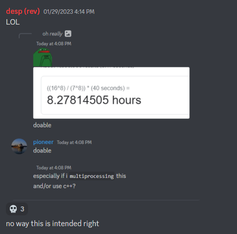
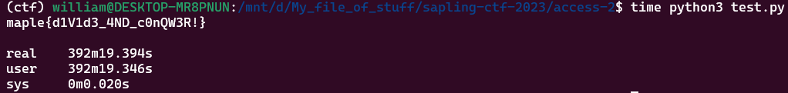

## `access-2`
### Problem Description
- Author: Arctic
    - We successfully got access for a few hours thanks to your hard work but they quickly realized the security flaw you exploited and revoked everyone's access so we have to do another decryption.
    - Can you do it?

### Solution
Now that the shuffle is `secret % 16`...surely we can't brute force this right?



...Turns out, you can brute force this *exactly* like you can `access-1`. Well, almost. We just start from the high end instead of the low end. I'm not even kidding.

```python
def make_key_hack(data):
    result = list(DATA_2)
    for secret in data:
        result = shuffle_using(result, secret)
    key = "".join(result[:8])
    return bytes.fromhex(key)

encrypted_flag = bytes.fromhex("20a667175dfa51fc1ef0b4c73fc6c96ba29fbd7612015d389a3c35b753124822")

for combo in product(range(16, 0, -1), repeat=8):
    decrypt_key = make_key_hack(bytes(combo))
    decrypted_flag = decrypt(decrypt_key, encrypted_flag)
    print(strip_padding(decrypted_flag), end="\033[2K\033[1G")

    if decrypted_flag.startswith(b"maple"):
        print(strip_padding(decrypted_flag).decode())
        break
```

For funsies, I ran the exact same script from `access-1` except changing `range(1, 8)` to `range(1, 16)`, and...



### Flag: `maple{d1V1d3_4ND_c0nQW3R!}`