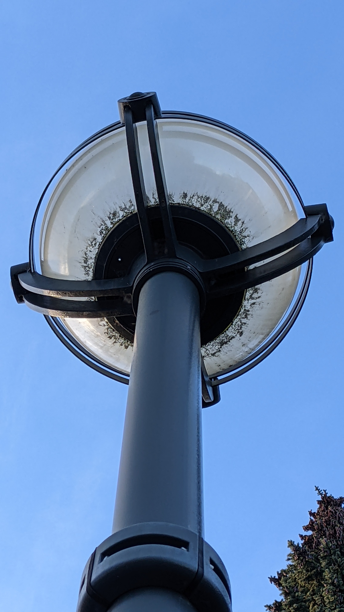

## `around-and-about`
### Problem Description
- Author: apropos
    - My friend texted me an image and asked me to "meet him here". Unfortunately, I have no idea where "here" is, and my friend is a terrible photographer! Can you help me out?
    - Wait, what do you mean this isn't the kind of image you were expecting?

### Solution
The input file is named `android-NEW.img`, but opening it in hex editor reveals that it's actually a SquashFS file. After unsquashing it, we get an Android filesystem, inside of which hidden in like 10 layers of folders is the following image:

A lamp post....not much to see here. Let's take a look at the metadata, and we see:

Looking this up on Google Maps gives us:

And there is in fact a lamp post there:

But the sneaky organizers hid the flag in a very obscure place:

### Flag: `maple{ctf_in_r34l_l1f3_??_?}`