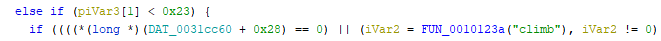

## `cgame`
### Problem Description
- Author: em
    - I found this game on an old disk in the basement, but not its manual.
    - I've heard you know how to reverse binaries---can you figure out what it's about?

### Solution


I could've figured this out so quickly and first blooded the entire `rev (progression)`

I even saw `"climb"` in the disassemble but I just never thought of actually typing `"climb"` at the `#`



But anyway `cgame` is a command line game where you have to get all 30 coins (visible in the disassemble as `while (DAT_0031cb24 != 0x1e);`), not much else to say

### Flag: `maple{saving_the_environment_1092899062}`

So I TAS'd it

### Script
```python
from pwn import *

context.log_level = 50

io = process(["./cgame"])

for i in "ddddddddddwwwwwwwwwwwwwwwwwaaaaaaawdddddddddddddddddddwwwwwwwwwwwwwwwwwwwwwwwaaaaaaaaaaaaaaaaaaaaasssssssssssssssssssaaaaaaaaaassssddddssaaaaaaaaaaaaaaaaaaaaaaaaaaaaaaclimbaaaaaaaaaaawwwdwdwwwawwaaaaasssssssssdddddddddddddddclimbdddsssssssssssaaaaaawwwwwwaaaaaaaaaaaaaaaaaaaaaaaaaaaaaaaaaaaaaaaaaaaaaaaaaaaaaaaaassssssssssssssdddddddddssssddddddddddddddddddddddddddddddddddddddddddddddddwwwwwwwwdddddddddddddddddddddssssssssssddddddddddddwwwssssssssssssssssssddddddddddddddddddddddddddddddddddddddaaaaaaaaaaaaaaaaaaaaaaaaaaaaaawwwwwwwwwwwddddddddddddddddddddddddddddddddclimbssssssssddddddddsssssssssssssssssssddddddddddddddddddddddddddddddwwwwwwwwwwwwwddddddddddddddddddddddddddddddddddddddddddddddddddddddddwwwwwwwwwwwxq":
    sys.stdout.buffer.write(b"\x0a".join(io.recvlines(40)))
    io.send(i)
    time.sleep(0.02)
```

https://user-images.githubusercontent.com/26018590/216798017-b3fb474b-4d58-4098-85a2-e631cfa11d67.mp4
