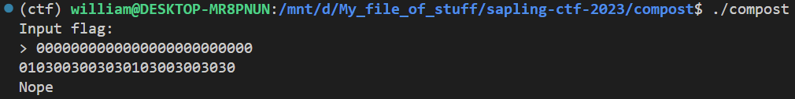

## `compost`
### Problem Description
- Author: em
    - No source code for this one, but you may still find it familiar.

### Solution
Nothing a *little bit* of Ghidra and a ***lot*** of brute forcing can't solve.

I actually solved this with a script *first* this time. Still brute force though, I ain't spending the time to actually rev this.

As usual, there's a check string, this time it's "hglhhlbomrrw_nebedrcllpue". Let's see what 25 0's get changed to.



Huh. This one is slightly weirder: the character at position $i$ in the "plaintext" doesn't always change position $i$ in the "ciphertext"....Brute force it is!

I first need to figure out which position $i$ changes which position $j$: this can be done with "0000000000000000000000000" as a base, and changing each "0" to a "1" in turn and seeing which position in the "ciphertext" changes.

```python
from pwn import *

context.log_level = 50

m = {}


def diff(s1, s2):
    for i, (a1, a2) in enumerate(zip(s1, s2)):
        if a1 != a2:
            return i

    return -1


normal_output = "0103003003030103003003030"
lst = ["0"] * 25

for i in range(25):
    lst[i] = "1"
    io = process(["./compost"])
    io.recvline()
    io.sendline("".join(lst).encode())
    output = io.recvline().decode()[2:-1]
    m[i] = diff(normal_output, output)
    lst[i] = "0"
    io.close()
```

After this loop finishes, `m` is a map from plaintext index to ciphertext index. We only need to run this with the check string. (didn't even bother to check how the rotation function works this time)

```python
lst = ["."] * 25
expected = "hglhhlbomrrw_nebedrcllpue"

for i in range(25):
    for j in range(33, 127):
        lst[i] = chr(j)
        io = process(["./compost"])
        io.recvline()
        io.sendline("".join(lst).encode())
        output = io.recvline().decode()[2:-1]
        print("".join(lst), end="\033[1G")
        io.close()

        if len(output) != 25:
            continue

        if output[m[i]] == expected[m[i]]:
            break

print("".join(lst))
```

### Flag: `maple{hello_from_the_decompiler}`

<video width="1024" height="560" controls>
  <source src="./compost.mp4" type="video/mp4">
</video>