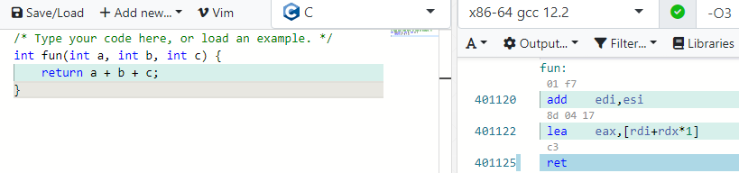

## `CPSC233 Assignment 1`
### Problem Description
- Author: aynakeya
    - CPSC233 Assignment 1 Instruction
    - This is your first assignment, in this assignmnet, we are going to make a simple calculator using x64 asm.
    - Just create an asm function that takes 3 integers and return the sum of them.
    - Online Learning Resource:
        1. x64 assembly reference: http://6.s081.scripts.mit.edu/sp18/x86-64-architecture-guide.html
        2. Exploring assembly language: https://godbolt.org/
        31. x64 cheat sheet: https://cs.brown.edu/courses/cs033/docs/guides/x64_cheatsheet.pdf

### Solution
Godbolt literally gives this to you lmao



### Script:

```python
io = start()
your_asm_code_here = """
 add    edi,esi
 lea    eax,[rdi+rdx*1]
 ret
"""
shellcode = asm(your_asm_code_here)
io.sendlineafter(b"here: ", shellcode.hex().encode())
io.recvuntil(b"here is your flag: ")
print(io.recvline().decode(), end="")
io.close()
```

### Flag: `maple{4_51mp13_c41cu14702}`