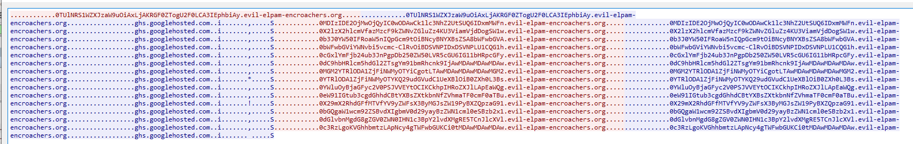

## `Devious Naughty Stealing`
### Problem Description
- Author: Dontmindme
    - Welcome to Misc. The following few challenges are linked in a similar story, however, this is no ordering to these challenges. Further, the techniques you will need to utilize to solve these challenges are completely unrelated. The only thing they all share? The need for a creative thinking, your knowledge of computing, and your willingness to learn. We've just recovered some network logs from the compromised machine. We've learned from other sources that the hackers have stolen emails, files, and other data from this machine. Something we're still not entirely sure of is how the hackers managed to avoid getting detected by our firewalls. Why didn't they flag suspicious communications? Take a look at these logs and find out. You can use Wireshark to open this file.

### Solution
TBH I have no idea how to web/network, I just mess with things until it works

opening the pcap in wireshark:



Looks like sus base64.

### Script
```python
import base64
import re

from scapy.all import *

pcap = sniff(offline="logs.pcap", filter="udp", quiet=True)
b = b""

for i in pcap:
    if i.payload.payload.payload.qr and i.payload.payload.payload.qd.qname.endswith(b".evil-elpam-encroachers.org."):
        b += i.payload.payload.payload.qd.qname[:48]

print(re.search(r"maple\{[a-zA-Z0-9_!\-\?]+\}", base64.b64decode(b, altchars="-_").decode())[0])
```

Looks like sus solve script too.

### Flag: `maple{dns_eXfi1trati0n_of_data_15_a_real_pr0blem}`