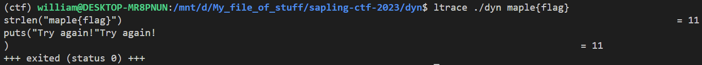
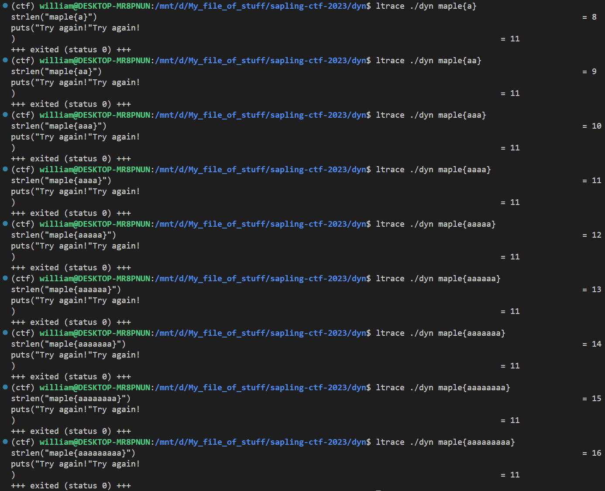
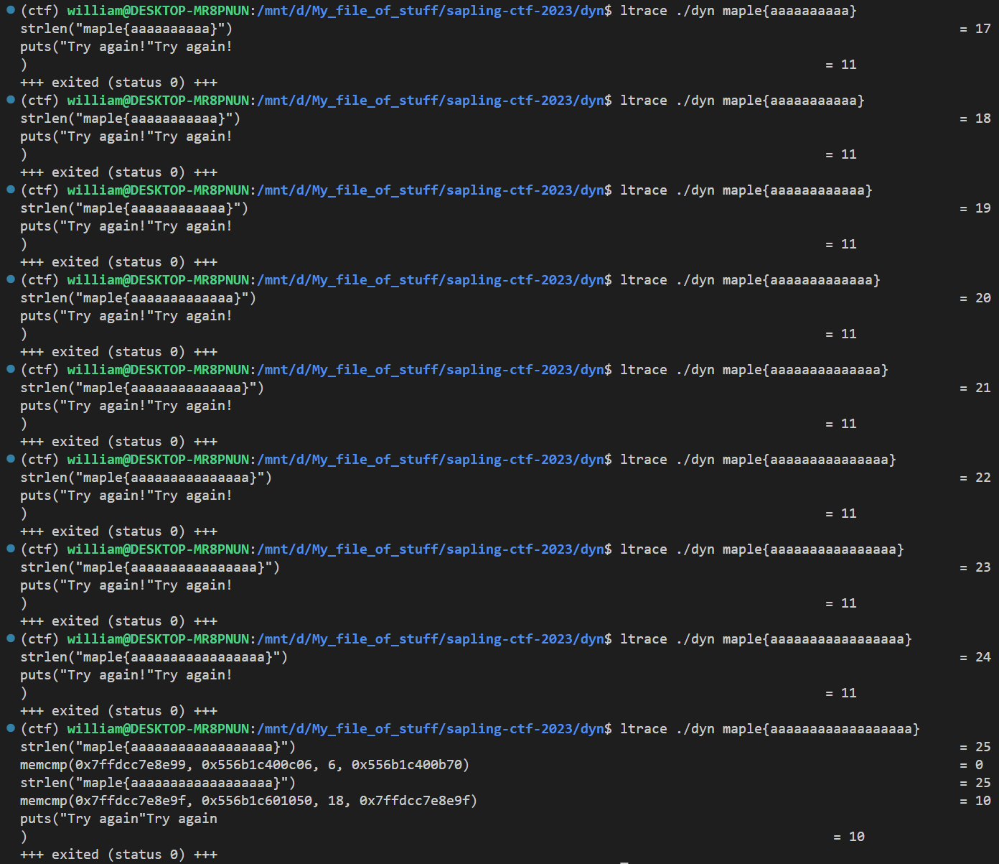
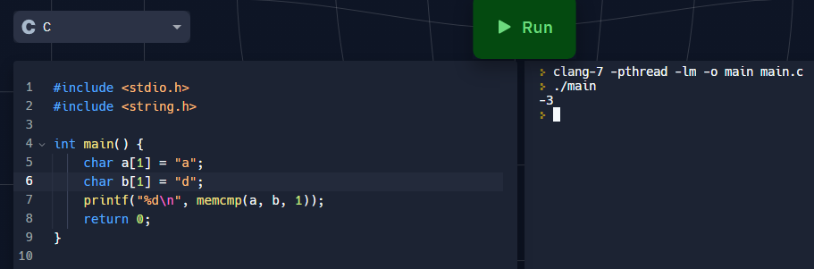
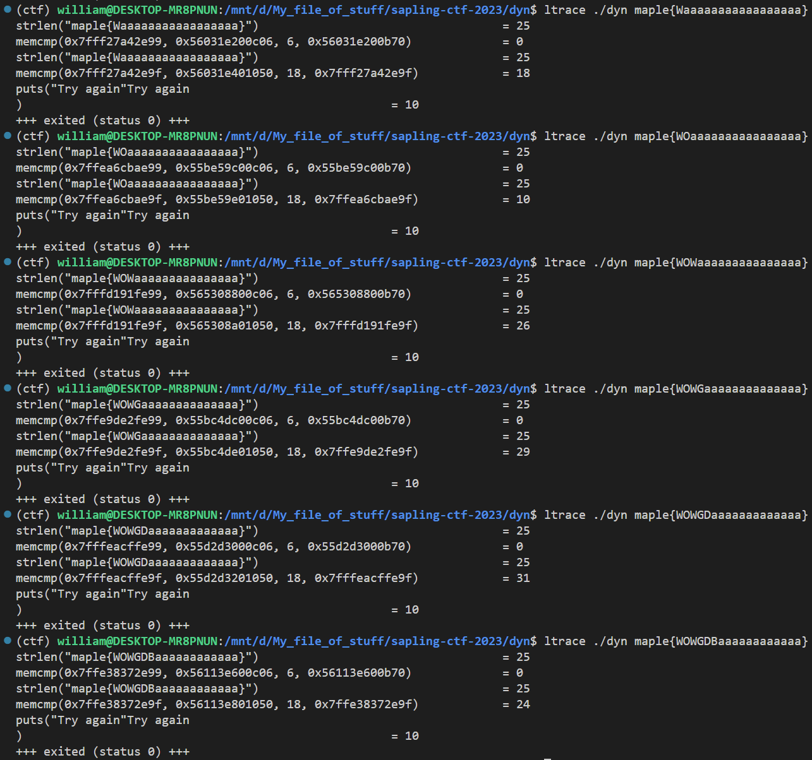
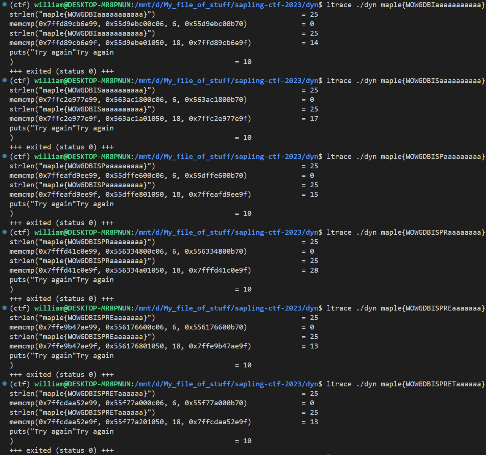
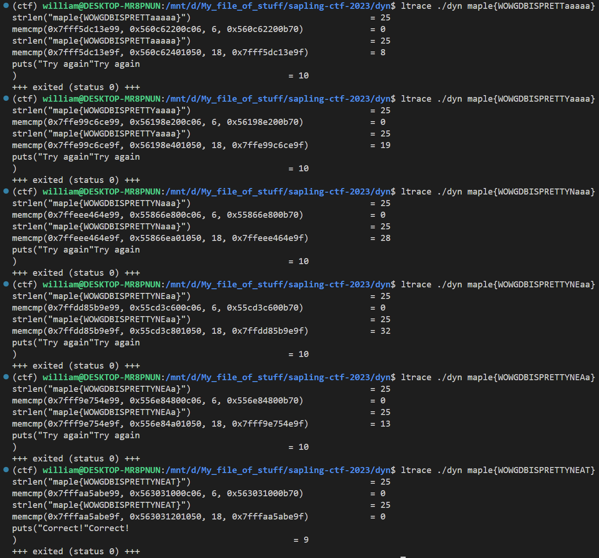
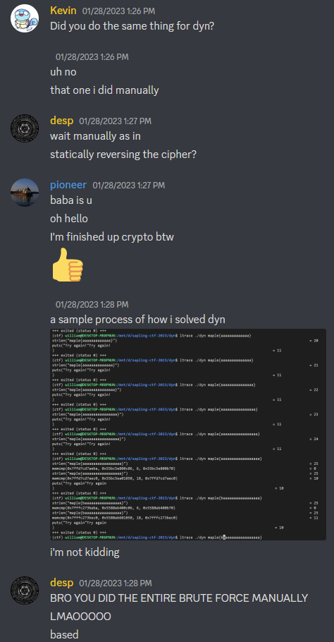

## `dyn`
### Problem Description
- Author: kz
    - Try playing around with this program. You may be surprised at what you are able to find.

### Solution
`ltrace` to the rescue! I did all manually btw.

`./dyn` takes in a flag argument, and we see that the first thing the code checks is the length of the flag:  



So I literally tried each length starting from `maple{}` until something different happens:





From this we can see that the flag is 25 chars long, then it looks like it's `memcmp` the flag against something, so we can take advantage of the fact that on some compilers, `memcmp` will actually tell you how far apart the first pair of differing chars are.



Also, you can tell *which* char differs by changing them one at a time. E.g. if you send `maple{HI}`, and `memcmp` returns `1`, then you send `maple{HJ}` and `memcmp` returns 2, then you know for sure that everything up to the second char in the flag compare the same. We just have to do this a billion times for each character...this is where an ASCII table is super useful.





### Flag: `maple{WOWGDBISPRETTYNEAT}`

P.S. I eventually wrote a script to automate this for me :)

```python
flag = "maple{" + " " * 18 + "}"
lst = list(flag)


def trace(s):
    io = process(["ltrace", "./dyn", s])
    io.recvlines(3)
    output = io.recvline()
    io.close()
    return output.decode().split()[-1]


for i in range(6, 23):
    for j in range(32, 127):
        lst[i] = chr(j)
        output = trace("".join(lst))
        print("".join(lst), end="\033[1G")
        old = lst[i + 1]
        lst[i + 1] = "."
        output2 = trace("".join(lst))

        if output2 != output:
            lst[i + 1] = old
            break

        lst[i + 1] = old

for j in range(32, 127):
    lst[23] = chr(j)
    output = trace("".join(lst))

    if output == "0":
        break

    print("".join(lst), end="\033[1G")

print("".join(lst))
```


I would also like to thank desp for the words of encouragement:

