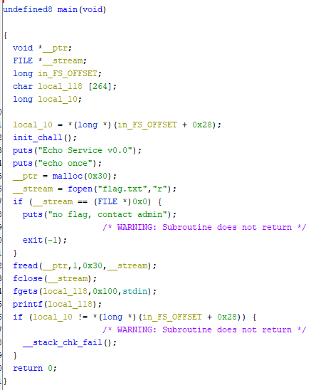

## `EAS: intro`
### Problem Description
- Author: aynakeya
    - Echo As Service
    - echo is a pretty useful function, so I made echo as a service!
    - Changelog:
    - v0.0: echo service prototype.

### Solution
Ghidra tiem



The given executable allows us to input one string, and it'll print whatever string we input. *Or does it...*

Looking at the decompile, we see that the flag is read from `flag.txt` into heap memory, accessed via `__ptr`. We can print the string given a `char` pointer in `printf` with `%s`. None of this is CTF yet.

*However*......looking at the `printf` in the decompile, it doesn't seem to specify *any* string argument. This lends itself to an exploit: if there's no string argument, then `printf` will read items from the *stack* one at a time to satisfy the format argument. For example, if you `printf("%d")`, it'll read one entry from the stack, and print it as a signed integer. If you `printf("%d %d")`, it'll read the two entries from the stack, and print them as signed integers. If you `printf("%4p")`, it'll read the fourth entry in the stack, and print it as a pointer. All we gotta do now is figure out which stack entry `__ptr` is. We could do it the smart way by analyzing the decompiled code more, but me like brute force so me go `%1$p` `%2$p` until me see `maple{...}`. Turns out it's the 8th argument on the stack. ¯\\\_(ツ)\_/¯

## Script
```python
io = start()
io.recvlines(2)
io.sendline(b"%8$s")
print(io.recvline().decode(), end="")
io.close()
```

### Flag: `maple{wh3r3_15_my_fl46_owo}`