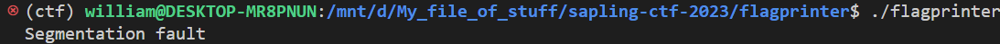
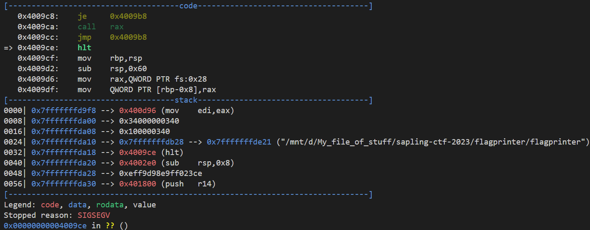
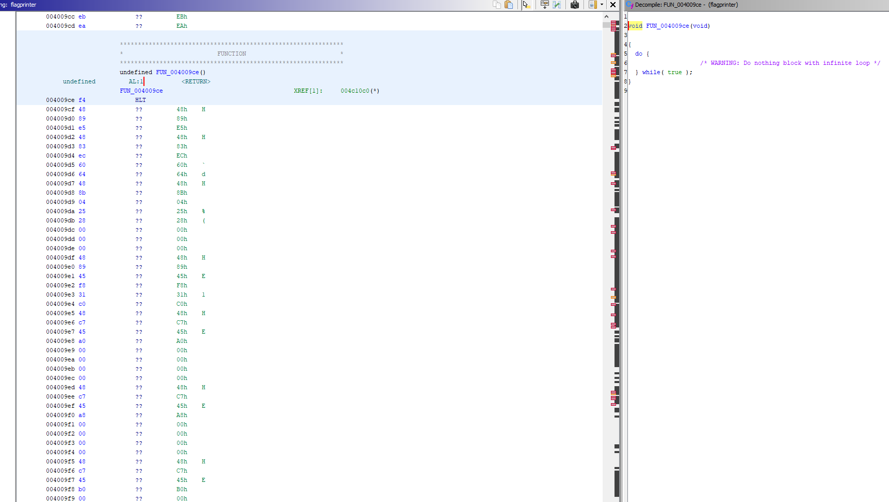
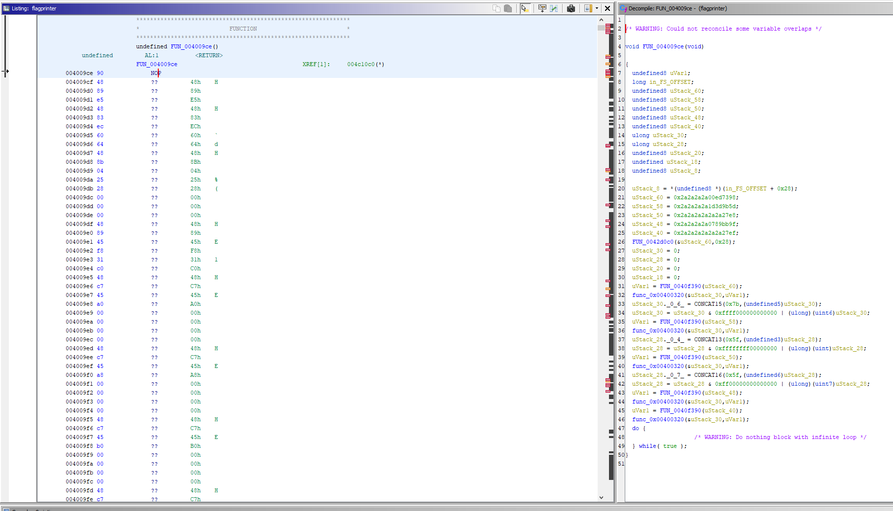
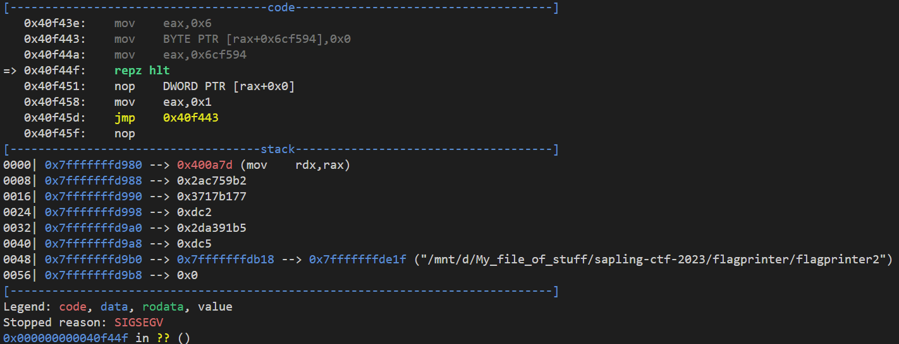
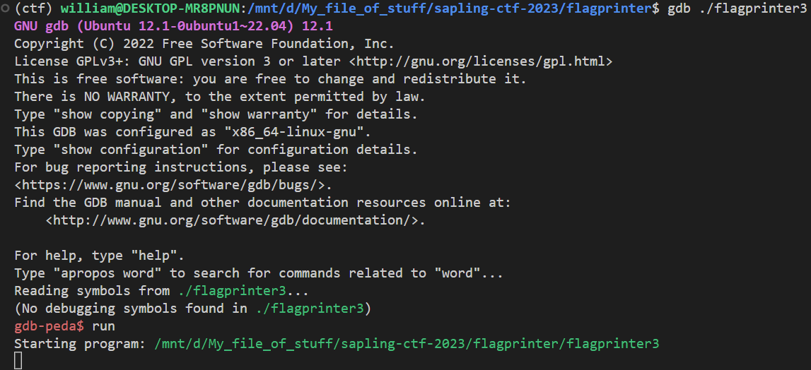
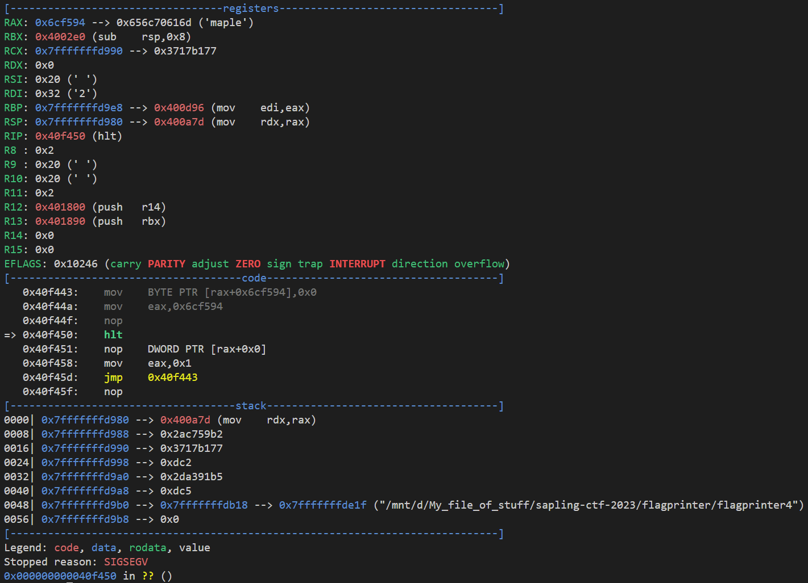
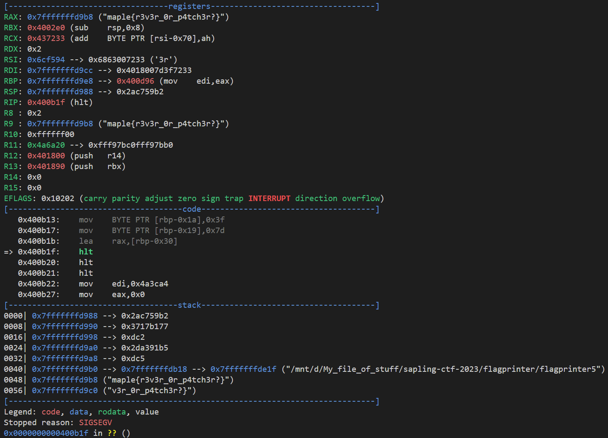

## `flag-printer`
### Problem Description
- Author: desp
    - Heh you think you can just print out my flag? I've intentionally broken my flag printer to *halt* your attempts!

### Solution
🧀

Let's run `./flagprinter` and see what happens.

GDB time!

Hmmmm there's a `hlt` here where it shouldn't be... and it looks a little sus in Ghidra ngl

I don't remember any assembly, so let's just change it to a `nop` and see what happens

Ooh! Let's run this and see where it segfaults now

There's another `hlt` at address 0x40f450...let's change that to also a nop and see what happens

Oops infinite loop? Let's change the `f3` before that to a `nop` and see what happens

Nothing useful. Let's try a `ret` instead.

Suddenly flag in the stack and registers??? I'll take it. 🧀🧀🧀🧀

### Flag: `maple{r3v3r_0r_p4tch3r?}`

P.S. thanks desp for providing good cheese.

