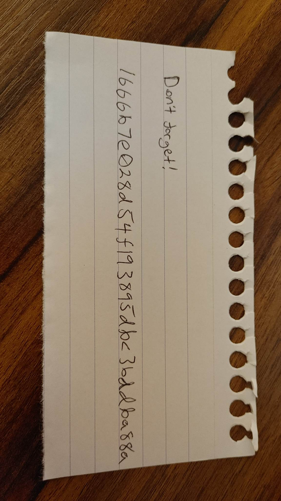

## `interception`
### Problem Description
- Author: Arctic
    - Intelligence has been successfully intercepting messages by the threat actor APT74 for the last few weeks but their messages are encrypted so we haven't been able to decode any of them.
    - Until now! By a stroke of luck we came across what we believe to be the key on a slip of paper discarded by one of the suspects. Your job is to set up your coding environment to run the decryption so we can proceed with the investigation
    - Our last cryptographer left you some advice here: https://ctf.maplebacon.org/crypto_interception

### Solution


Decrypting a ciphertext when you're ***given the key?????*** Surely this is too easy...wait is that a `b` or a `6`?

### Script
```python
import re

from Crypto.Cipher import AES

key = "1666b7e028d54f193895dbc3bddba88a"
cipher = AES.new(bytes.fromhex(key), AES.MODE_ECB)

with open("messages.txt") as f:
    for i in f.readlines():
        msg = bytes.fromhex(i[3:-1])
        match = re.search(r"maple\{[a-zA-Z0-9_!\-\?]+\}", cipher.decrypt(msg).decode())

        if match:
            print(match[0])
            break
```

### Flag: `maple{5upeR_5ECReT_ExCh4nGE}`