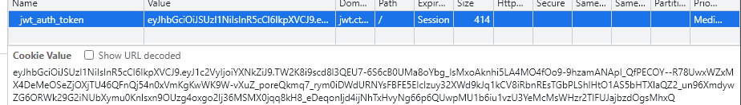
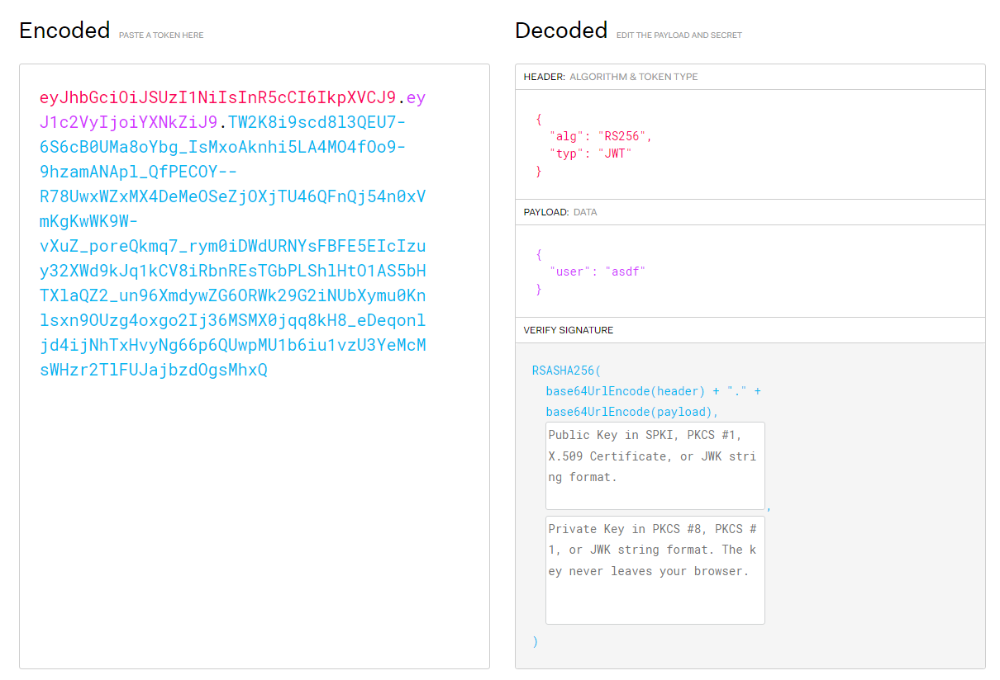

## `Java Windows Terminal`
### Problem Description
- Author: vEvergarden
    - We found this hidden website attached with a note, but we can't find our flag! The note said something about JWTs... Java Windows Terminal? Jim Wolf Technology? Either way, we also found a script lying around on the computer. Maybe you'll know what to do with it...

### Solution
The first thing I googled was "ctf RSA find private key given public key" and literally the first link was https://github.com/RsaCtfTool/RsaCtfTool. Downloaded it, ran `RsaCtfTool.py` on `public.key`, and what do you know, it cracked the private key in about a minute:

<video width="1024" height="560" controls>
  <source src="./java-windows-terminal.mp4" type="video/mp4">
</video>

Only after I cracked it with the tool did I realize that `p` and `q` in `generate_keys.py` were suspiciously close 🤦

After that, I tried logging in to http://jwt.ctf.maplebacon.org:8000/login, and yeeted the cookie once I logged in:

Paste it into https://jwt.io/, pasted the public/private key, changed the payload to `"user": "admin"`, then fiddle around with it more to get the flag.

### Flag: `maple{f3rm4t_!n_7h3_m0d3rn_w0r1d}`