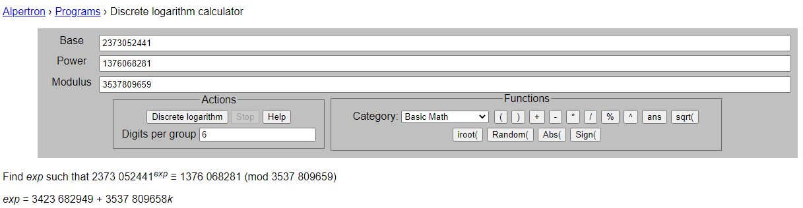

## `Pop Quiz`
### Problem Description
- Author: vEvergarden
    - A small pop quiz to get you started! Try out the general skill challenges to learn some Python basics and how to connect to the service with netcat.

### Solution
7 math questions, like in an actual pop quiz. Fortunately, we have the power of Python (and WolframAlpha) to help!
- Q1: What is the value of 43649 modulo 13?
    - Starting off real easy here. I could do this in my sleep. `8`.
- Q2: What is the value of 244283656037791128349291523504312825561 modulo 16280193460294221079?
    - Oh sh\*t oh f*ck I don't want to long division a 39 digit number by a 20 digit number.....meanwhile Python be like  
      
    and it doesn't even break a sweat. If only I could do that.
- Q3: Find the value of 739 ^ 11. Note: the caret \[^\] refers to exponentiation.
    - Python to the rescue, because I'm simply too lazy to do this manually:  
      
    Easy.
- Q4: Find the value of 63667 ^ 55249 modulo 40507
    -   
    I'm getting bored here.
- Q5: Find the value of 3882516727 ^ 2162677339 modulo 17856793048016463091
    -   
    .....Python hello? Are you still alive? Oh no Python is taking too long WolframAlpha help  
      
    ...Phew.
- Q6: What value of y satisfies: 41 ^ y == 4 modulo 43? (You can enter any such y value)
    - ...Dunno how to do this in Python. Screw Python, WolframAlpha is my bae now.  
      
    ...Looks like 2 works LMFAO. Guess I should've manually checked a couple, huh.
- Q7: What value of y satisfies: 2373052441 ^ y == 1376068281 modulo 3537809659? (You can enter any such y value)
    -   
    Oh no........ even WolframAlpha died. Guess it's time to look up this "discrete logarithm problem" thingy. Looks like (this)[https://www.alpertron.com.ar/DILOG.HTM] is a nice one. Let's give it a try:  
      
    Nice! Don't think I'll need to use this site for anything else though. (Clueless)

### Flag: `maple{0nt0-7h3-n3xt!}`