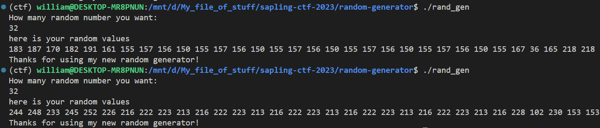

## `Random generator`
### Problem Description
- Author: aynakeya
    - We have developed a secure random number generator service using stack value! Hint: you need more iteration

### Solution
Brute force strikes again

We see in `main.c` that a seed is randomly generated, and a buffer is created to store the random values...Except the output looks strange...



Why are the last 4 numbers different from the first 28? :susge:

We reread the code, and realize that before `rand_generator` is called, `is_flag_exits` (nice name btw) is called, **which also creates a buffer on the stack**, which has the contents of `flag.txt` read into. This tells me that the two buffers in `is_flag_exits` and `rand_generator` probably overlap. We also see that each value in `rand_values` is XOR'd with the same `seed`, so XOR-ing each value with that `seed` will recover the original values. But there's no way of knowing `seed` right?

`seed` is a single byte so we can just brute force all 256 possible lmao

### Script
```python
io = start()
io.recvline()
io.sendline(b"32")
io.recvline()
lst = [int(i) for i in io.recvline().decode().split()[:28]]

for i in range(256):
    for j in range(len(lst)):
        lst[j] ^= i

    if bytes(lst).startswith(b"maple"):
        print(bytes(lst).decode())
        break

    for j in range(len(lst)):
        lst[j] ^= i
```

### Flag: `maple{n0t_cOmpI3t3ly_r8n6om}`