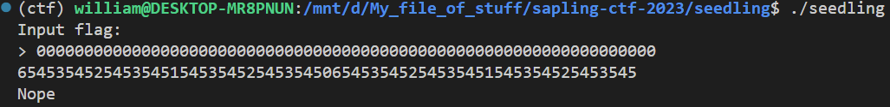
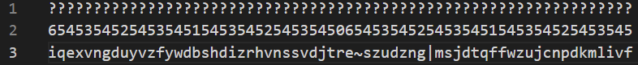
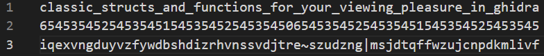

## `seedling`
### Problem Description
- Author: em
    - Jason told me to write a description for this, but I have nothing to say.
    - Read the code, not this!

### Solution
You would think that I would be smarter after doing `dyn`, and not manually do the challenge one char at a time......***you're absolutely undeniably definitely incorrect***. I did `seedling` manually too.

Anyway, the given code looks like some linked list tree funky business, and it looks *suspiciously* like building a balanced binary tree from an array....we're also given a `check_str`; that'll come in handy later. I've TA'd 221 way too many times, so I saw the tree thing instantly (in fact, it's a question we like to ask!). There's one catch though: `treenode`s are rotated with `rotate_char`, so it's not just a matter of "first char in flag is the middle char of `check_str`". Guess I'll go back to the drawing board...



*wait a minute* what's this?

Turns out, this tells us *exactly* how much each char is rotated by, depending on the position. Great! we didn't even need to actually figure out what `rotate_char` does. Now it's just a matter of ASCII table lookups...



This is gonna take ages...



### Flag: `maple{classic_structs_and_functions_for_your_viewing_pleasure_in_ghidra}`

As usual, I only wrote the script to automate this *after* I solved the challenge...what great time spent

## Script
```python
from pwn import *

context.log_level = 50


def unrotate(c, n):
    return (c - 32 - n) % 95 + 32


check_str = b"iqexvngduyvzfywdbshdizrhvnssvdjtre~szudzng|msjdtqffwzujcnpdkmlivf"

io = process(["./seedling"])
io.recvline()
io.sendline(b"0" * 65)
io.recvuntil(b"> ")

levels = [int(i) for i in io.recvline().decode()[:-1]]
print("maple{" + bytes(unrotate(check_str[i], levels[i]) for i in range(len(check_str))).decode() + "}")
io.close()
```