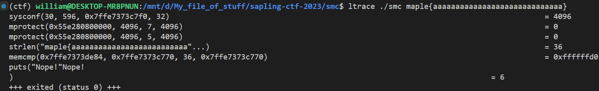
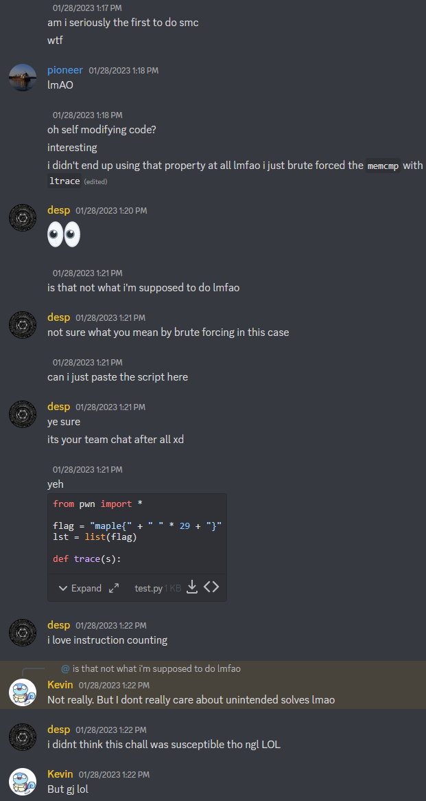

## `smc`
### Problem Description
- Author: kz
    - I heard Ghidra is a pretty neat tool but you can't reverse what you can't see.

### Solution
You don't need to see if you just brute force :)

Similar to `dyn`, we can use `ltrace` to figure out a lot of things, for example, the flag is 36 chars long:



But the `dyn` strat of changing one char at a time to see if `memcmp`'s output changes is significantly more difficult. Unless you bring in brute force. I still don't know what the intended solution is. Something with self modifying code? Absolutely no clue.

### Script
```python
from pwn import *

context.log_level = 50

flag = "maple{" + " " * 29 + "}"
lst = list(flag)


def trace(s):
    io = process(["ltrace", "./smc", s])
    io.recvlines(4)
    output = io.recvline()
    io.close()
    return output.decode().split()[-1]


for i in range(6, 35):
    for j in range(32, 127):
        lst[i] = chr(j)
        output = trace("".join(lst))

        if output == "0":
            break

        print("".join(lst), end="\033[1G")
        old = lst[i + 1]
        lst[i + 1] = "."
        output2 = trace("".join(lst))

        if output2 != output:
            lst[i + 1] = old
            break

        lst[i + 1] = old

print("".join(lst))
```

### Flag: `maple{1s_Th1s_53lf_Modify1ng_C0d3??}`

<video width="1024" height="560" controls>
  <source src="./smc.mp4" type="video/mp4">
</video>

As usual, thanks to desp and kz for their words of encouragement.

