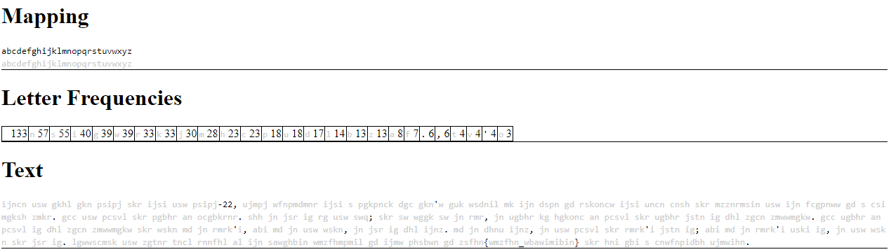
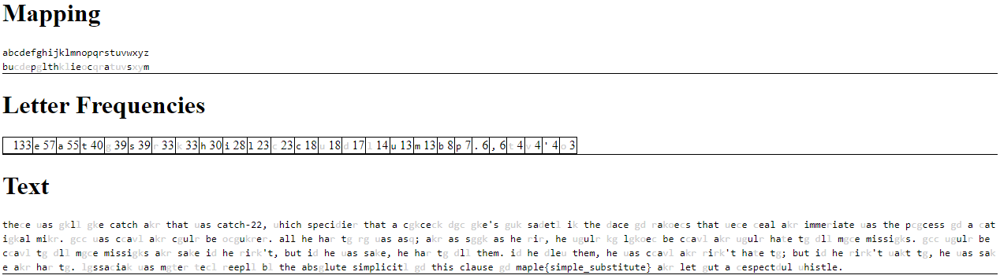

## `when-in-rome-1`
### Problem Description
- Author: Arctic
    - A famous type of cipher is a substitution cipher, which exchanges each letter of the original message with another message.
    - Solving them manually can be quite fun so we wrote an interactive solver for you to solve this challenge, have fun!

### Solution

Literally just a substitution cipher, along with a *very* helpful letter frequency table of the ciphertext. Plug and chug. The flag in the ciphertext is `zsfhn{wmzfhn_wbawimibin}`, so we know `m -> z, a -> s, p -> f, l -> h, e -> n`. We then see 5 letters followed by `-22`, so we know that must be `catch-22`, giving us `c -> p, t -> i, h -> j`. At this point, `wbawimibin` in the flag is `????t?t?te`, so we could reasonably guess that the plaintext is `substitute`, considering this is a substitution cipher.

At this point, we're actually done: all letters used in the flag have been deciphered, so we can literally ignore everything else.

### Flag: `maple{simple_substitute}`