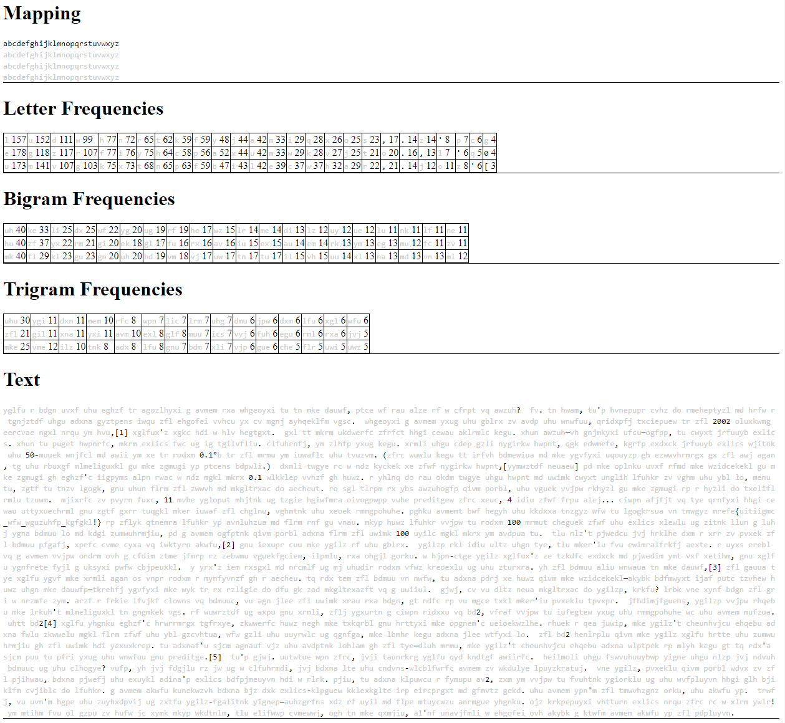
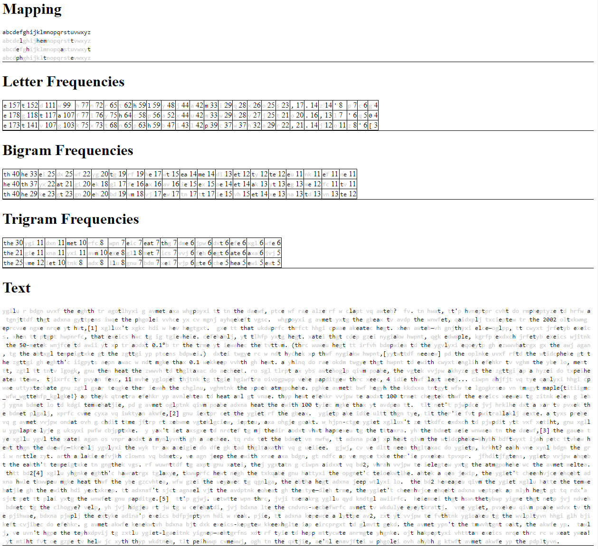
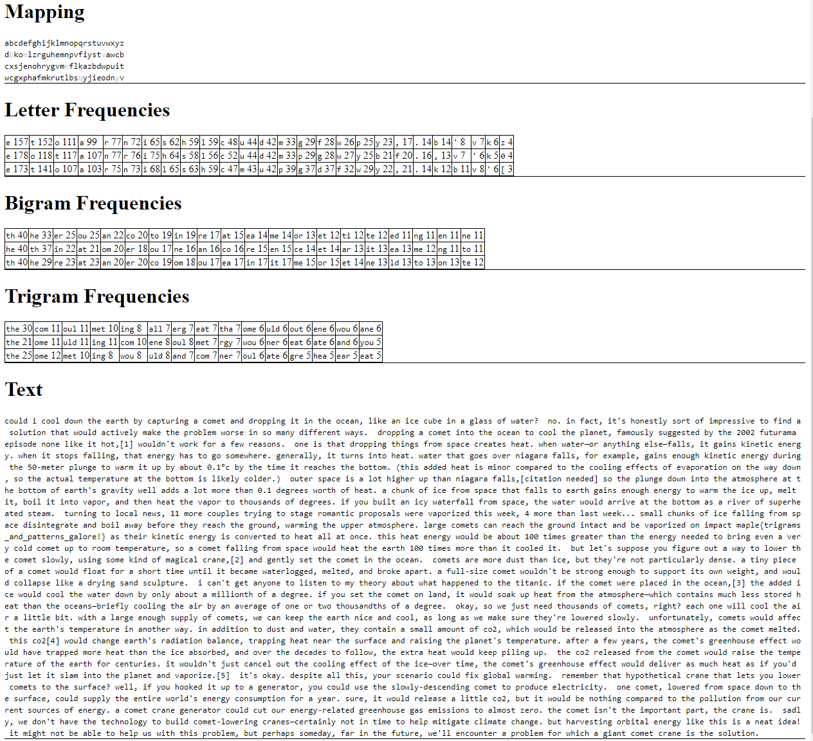

## `when-in-rome-2`
### Problem Description
- Author: Arctic
    - Now for a harder substitution cipher. We now have three substitution functions, each substituting one letter at a time.
    - You'll have to be a bit more clever to solve this one!

### Solution

Now we've upgraded! we have three substitution ciphers used in conjunction, where letter at position $i \equiv 1 \pmod 3$ is substituted using the first cipher, at position $i \equiv 2 \pmod 3$ substituted using the second cipher, etc. This makes our deciphering task significantly more difficult. However, we now also have bigram and trigram frequencies along with our letter frequencies. As usual, we spot the flag hidden among the ciphertext, and immediately write the `maple` bit. Thanks to https://www3.nd.edu/~busiforc/handouts/cryptography/Letter%20Frequencies.html and intuition, the most common trigram is `the`, so we put that for the top trigram in all three ciphers.

We're also told that the text is about science and space, so we can start figuring out most words missing a few letters: there's `earth`, `temperature`, and `atmosphere`, at which point we can tease out the first word in the flag: `trigrams`. We then just continue filling in words we can figure out (I'm gonna spare the details), and we get:

### Flag: `maple{trigrams_anc_patterns_galore!}`